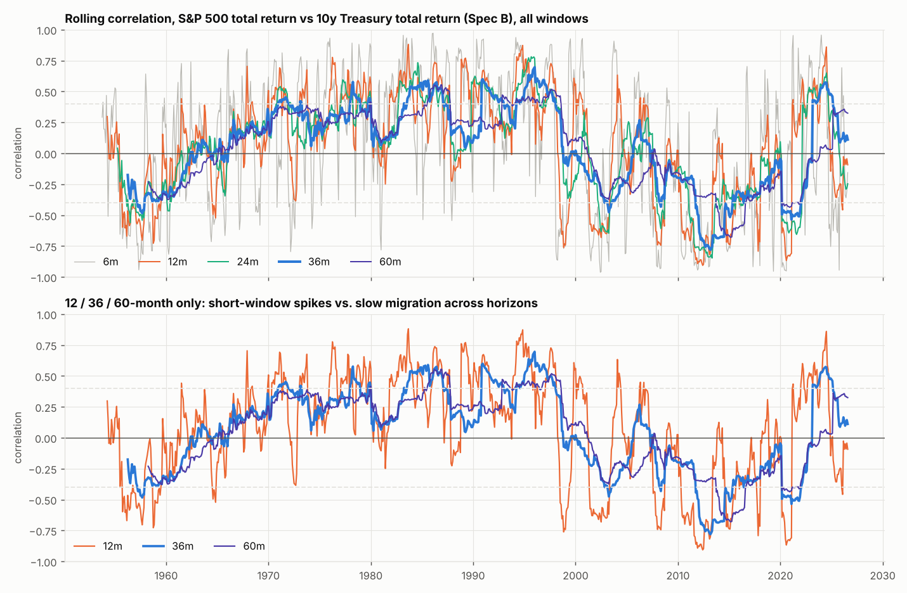
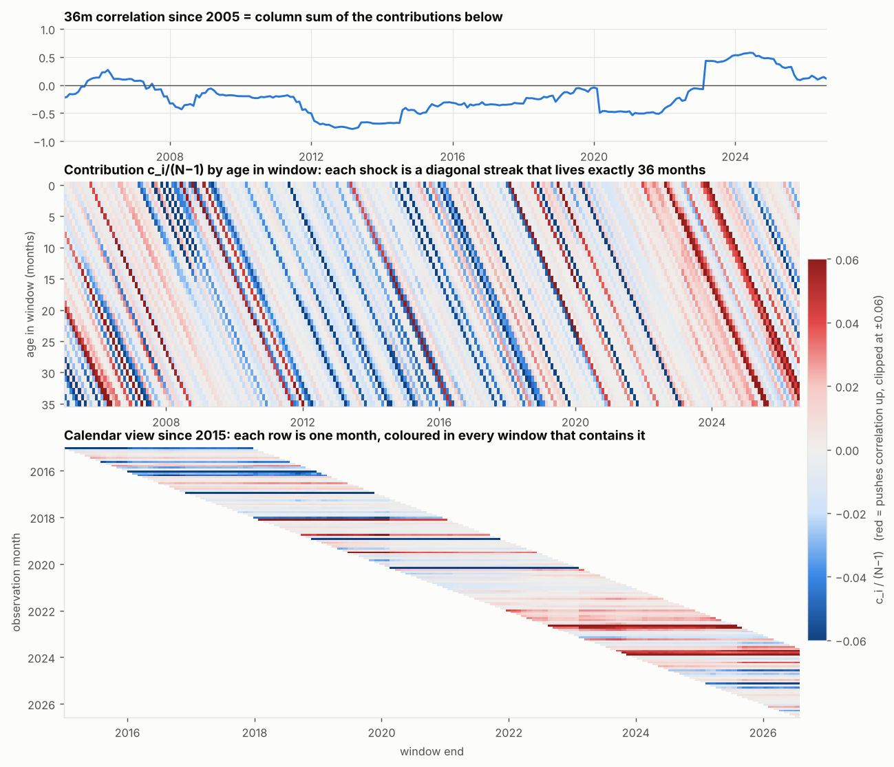
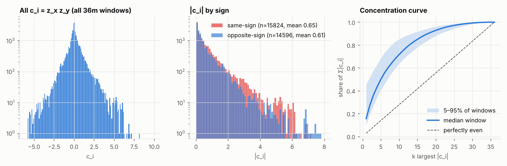
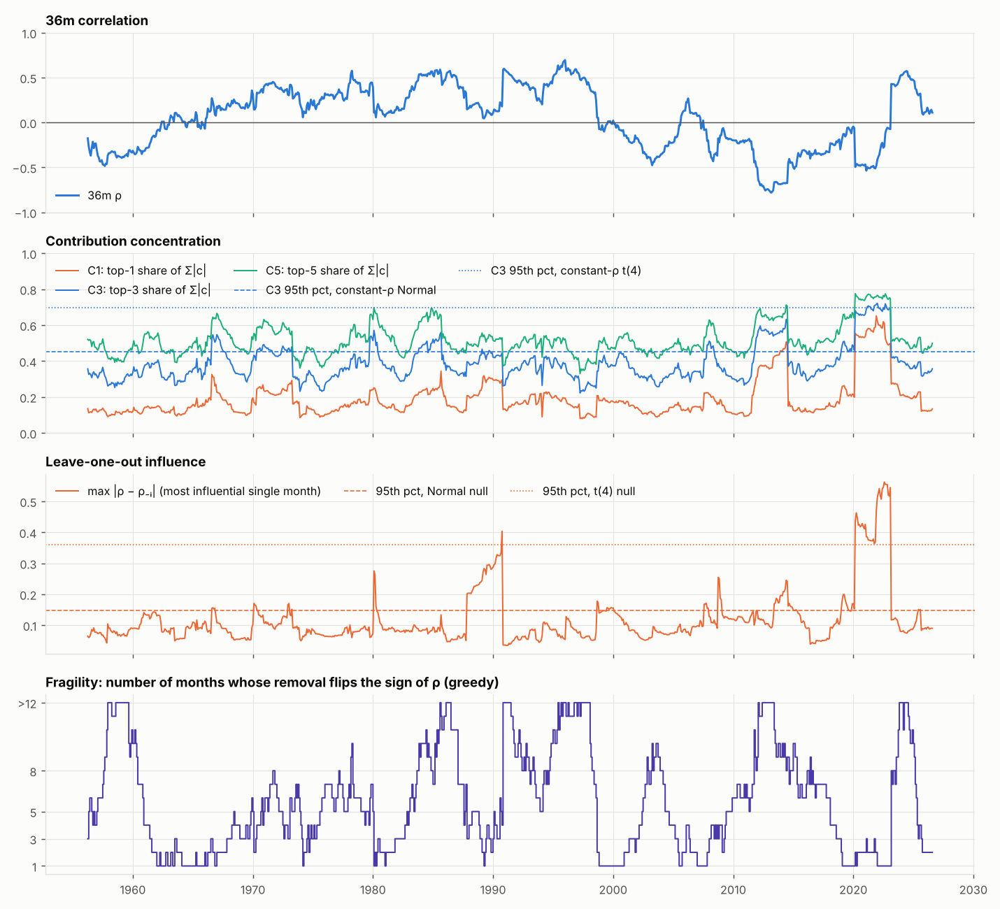
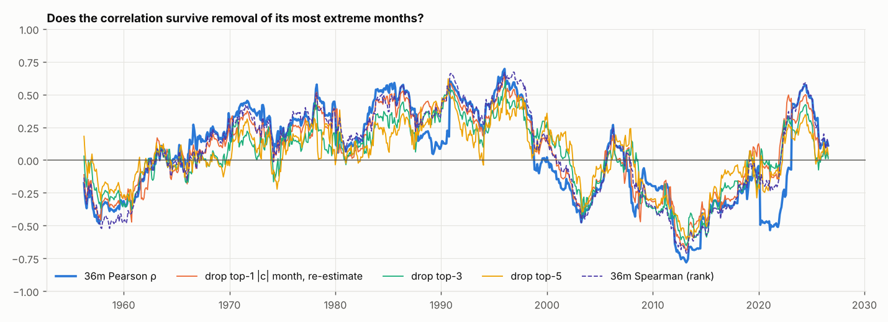
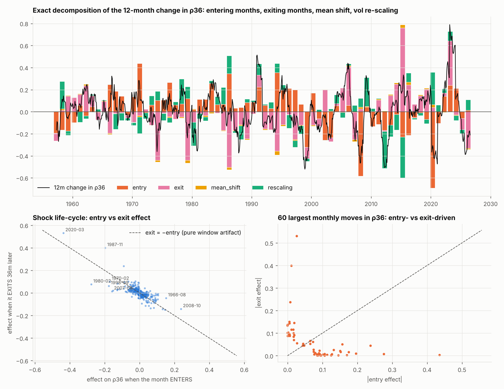
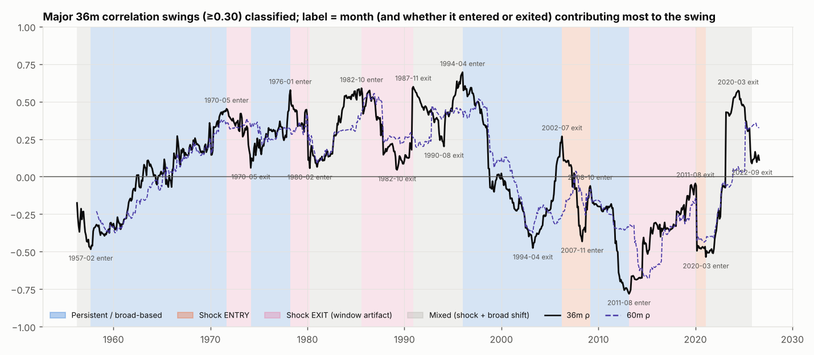
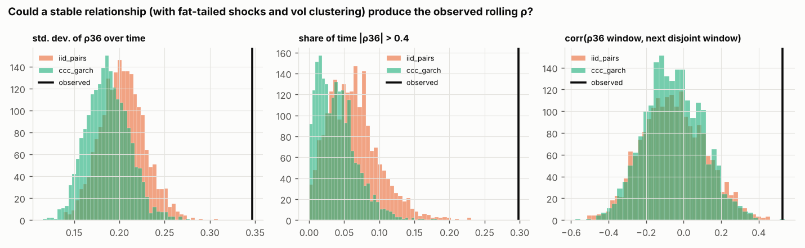
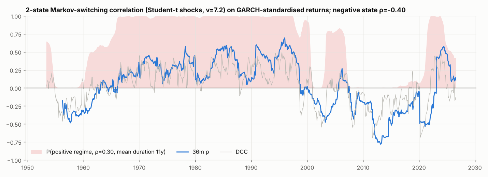
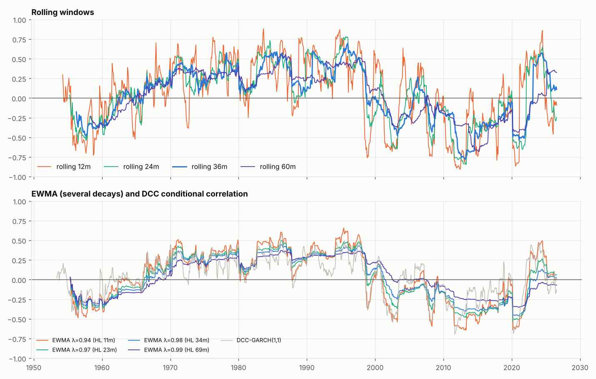

# Why does the US stock/bond correlation move? Shocks vs. regimes, 1953–2026

**Data:** Robert Shiller, `ie_data.xls`. Monthly data from **May 1953 to Aug 2026 (880 months)**.
**Primary specification:** a rolling **36-month** Pearson correlation for **Spec B**, the S&P Composite total return vs. the 10y Treasury total return.
**Code:** `python run_study.py` (dependencies are in `requirements.txt`) reproduces every number and figure below in about one minute. Tables are in `output/tables/`, figures in `output/figures/`, and headline numbers in `output/results.json`.

---

## Summary: two sources, gradual shift vs. shock

Condensed to two sources, **the gradual shift sets where the correlation is, and shocks cause most of the movement you see in the rolling line.** Shocks move it fast and then undo it when they leave the window, so they leave no lasting mark. The gradual shift is slow, but it sets the sign and lasts 7–11 years.

Here "shock" means the few most extreme months in each window, including the reversal when such a month *leaves* the window. "Gradual" is everything else, measured by the correlation after dropping the top-3 months.

| What you measure | Gradual shift | Shock |
|---|---|---|
| **Level** of the 36m correlation (positive vs negative, regimes) | **~65%** (about 90% on rank correlation) | ~35% |
| **Changes** in the 36m correlation over 1–3 years | ~35–45% | **~55–65%** |
| **Size of the 19 big swings** (≥0.30) | ~35–40% | ~60–65% |

**What this means in practice**

1. **The sign and the regime come from the gradual shift.** The correlation was positive from about 1965 to 1999 and negative from about 2000 to 2021. That changed because many months moved together, not because of single events. Removing the 3 most extreme months from each window barely changes this picture, and rank correlation explains about 90% of it.
2. **Most of the visible swings come from shocks, and each shock hits twice.** It moves the correlation when it enters the window and moves it back 36 months later when it leaves. Nov-1987, Aug-2011 and Mar-2020 each moved the correlation by 0.4–0.6, with no lasting effect on the level.
3. **The two sources look different on the chart.** A gradual shift shows up in every window length, from 12 to 60 months, and builds over years. A shock shows up as a step in the 36-month line, a reverse step exactly 36 months later, and little change in the 60-month line.
4. **2021–24 shows both at once.** The correlation went from −0.54 to +0.57. About 40% of that is Mar-2020 leaving the window. The other 60% is a real move to positive correlation during the 2022–23 inflation and rate shock.

**One-line version:** stocks and bonds have shifted slowly between a positive regime (about +0.3) and a negative one (about −0.4), each lasting roughly a decade. Rolling correlations exaggerate how often this happens, because single crash months create large temporary swings on top of the slow trend.

These shares are approximate (ranges of ±5–10 points); the exact figures are under `two_source_split` in `output/results.json`. Dropping the top 3 months each window overstates the shock share of the level a little. Crediting each swing to its 3 biggest months overstates it in long swings such as 1957–71.

---

## 0. Bottom line

> **The correlation's big moves between strongly negative and strongly positive are regime changes, not shock artifacts.** But a large share of the *medium-sized, sudden* moves (about 0.3–0.5) are produced by **one or two extreme months entering, and especially *leaving*, the 36-month window.**

| Question | Answer |
|---|---|
| A few extreme months? | **Sometimes, and mostly in the negative-correlation periods.** In a typical window the top 3 months carry 36% of Σ\|z_x z_y\|. A Gaussian with constant correlation gives 34%. Two months stand out: **Nov-1987** and **Mar-2020**. Each is a single month that moved ρ36 by more than 0.4 when it was removed, beyond the 95th percentile of a fat-tailed (t4) null. **Aug-2011** and **Oct-2008** are smaller versions of the same thing. |
| Many months accumulating? | **Yes, for every large multi-year swing.** Over the swings 1957→71, 1974→78, 1996→2003, 2003→06 and 2009→13, the change is spread over 23–56 effectively-contributing months. In each of these, the correlation after dropping the top-3 months moves by at least 50% as much as the raw correlation. |
| Months entering or leaving the window? | **Yes, mechanically important.** Exiting months account for about **45–50%** of the variance of rolling-ρ changes. A month's effect when it enters and when it exits correlate at **−0.76**. Five of the 19 major swings are classified as mainly *exit* artifacts: the 1973–74 drop, 1980, 1987–89, the 2013–2020 drift up (Aug-2011 exits) and the 2023 jump (Mar-2020 exits). |
| A real regime change? | **Yes, decisively.** A stable relationship with fat-tailed common shocks and volatility clustering cannot produce the observed history (p < 0.001 on three statistics). The correlation is persistent across non-overlapping windows (0.53, against a null 95th percentile of about 0.2). A 2-state correlation-switching model with t-shocks beats a constant-correlation t model by **ΔBIC ≈ 37**. Its two states are **ρ ≈ +0.30 (mean duration about 11 years)** and **ρ ≈ −0.40 (about 7 years)**. |

Measured by the absolute size of the 19 major 36m swings (|Δρ| ≥ 0.30, total Σ|Δρ| = 11.7):

- persistent / broad-based: **35%**
- mixed (a shock on top of a real shift): **28%**
- shock **exit** (window artifact): **23%**
- shock **entry**: **13%**

So **roughly two thirds of the total movement involves a genuine change in co-movement, and roughly one third is single-shock mechanics.**

---

## 1. Data preparation and specifications

| Series | Construction |
|---|---|
| Stock return | `(P_t + D_t/12) / P_{t-1} − 1`, S&P Composite. Dividends for Jul–Aug 2026 are forward-filled. |
| **Spec A**: rate change | `Δr_t = GS10_t − GS10_{t−1}` (percentage points) |
| **Spec B**: bond return | Shiller's *Monthly Total Bond Returns* column, shifted by one month. Shiller's column at row t is the return from t to t+1; I verified this because its correlation with Δr_{t+1} is −0.975. |

**Sample start, May 1953.** Before 1953 Shiller's long rate is an *annual* series linearly interpolated to monthly. Monthly Δr is therefore constant within each year, with an autocorrelation of 0.90, and a monthly correlation analysis on it is meaningless. A long-history view built on *annual* returns is in the appendix (fig13). **Sept 2026 is excluded** because its price and yield are 1st-of-month snapshots rather than monthly averages.

**Spec A vs Spec B:** the 36m correlations are mirror images: corr(ρ_B, −ρ_A) = **0.9996**, with a maximum gap of 0.05. Shiller's bond return is *built from* GS10 (carry plus duration × Δy), so Spec B is essentially −duration × Spec A. Every conclusion holds for both, and the episode classifications are identical on all 18 swings the two specs share (`episodes_36m_specA_sign_flipped.csv`). The report shows Spec B. Real (CPI-deflated) returns give a 36m correlation that tracks the nominal one at 0.99 (fig02).

Caveat: Shiller's prices and GS10 are **monthly averages of daily values**. This smooths returns and shifts crash timing. The October-1987 crash shows up mainly as **Nov-1987** (−12.3% on monthly averages), and the COVID shock as Mar-2020.

---

## 2. Rolling correlations across horizons (fig01)



- **The levels are coherent across horizons.** The correlation between the 36m and 60m series is 0.88, and between 12m and 60m it is 0.62. The big sign regimes are visible at every window length: negative in the 1950s, positive from the mid-1960s to 1999, negative 2000–2021, positive 2022–24.
- **The changes are not coherent at short horizons.** Twelve-month *changes* in the 12m correlation correlate only **0.30** with changes in the 60m correlation, and 36m changes correlate 0.35 with 60m changes. Most short-window movement is noise or single events that never show up in the long windows.
- **Visible examples.** The 12m correlation repeatedly spikes to ±0.8 within a regime (1987, 2008, 2020) while the 60m barely moves. In contrast, 1997–2001 and 2021–23 show *all* horizons migrating together, which is the regime-change signature.

---

## 3. Contribution decomposition (fig03, fig03b, fig04)

With sample standard deviations, `ρ = Σ c_i/(N−1)` holds **exactly**, where `c_i = z^X_i z^Y_i`. Every c_i for every window is saved in `contributions_36m_*.csv.gz`, about 30k rows per spec.



In the **age view**, a month's contribution travels diagonally down the window and drops out after exactly 36 months. Two patterns are visible since 2005:

- **2008–2020** is a dense series of blue (opposite-sign) streaks of moderate intensity: a *broad* negative relationship. A few very dark streaks sit on top of it (Oct-2008, Aug-2011, Mar-2020).
- **2022–2024** is a dense block of red streaks of moderate intensity: many months in which stocks and bonds fell or rose together. This is a broad-based change, not a single month.



The contributions are very fat-tailed: single values reach c ≈ 8–9, against a median |c| of about 0.4. The median window's concentration curve is close to what a Gaussian with constant correlation produces.

---

## 4. Contribution concentration (fig05, `concentration_by_rho_bucket.csv`)

| Median over all 845 windows | C1 | C3 | C5 | C10 |
|---|---|---|---|---|
| Observed | 15.5% | 36.3% | 49.9% | 71.7% |
| Null: constant ρ=0.3, Normal (median / 95th pct of C3) | | 33.7% / 45.4% | | |
| Null: constant ρ=0.3, t(4) fat tails (median / 95th pct of C3) | | 45.2% / 69.6% | | |

- 18.7% of windows are more concentrated than the Gaussian 95th percentile. Only **1.3%** exceed the fat-tailed 95th percentile, and those are almost all windows containing **Mar-2020**.
- **Asymmetry.** **Strongly negative** windows (ρ < −0.4) are the most concentrated: median C1 = **37%** and max leave-one-out influence = 0.16. **Strongly positive** windows (ρ > 0.4) are diffuse: C1 = 19% and max influence = 0.08.
  - Negative correlation readings depend on a few large **flight-to-quality** months, where stocks crash and Treasuries rally.
  - Positive correlation is built from **frequent, moderate same-direction moves**, the inflation/rate-shock regime.



---

## 5. Leave-one-out influence (`leave_one_out_36m_*.csv.gz`, `episode_top_influential_months.csv`)

Median max |ρ − ρ₋ᵢ| is **0.09**. The 95th percentiles of the nulls are 0.15 (Normal) and 0.36 (t4). In **7% of windows** a single month moves ρ by more than 0.25.

**Largest single-month effects:**

| Window ending | ρ36 | Excluding | ρ without it |
|---|---|---|---|
| Feb-2021 | **−0.54** | Mar-2020 | **−0.15** |
| Dec-2022 | **−0.06** | Mar-2020 | **+0.46** |
| Apr-1989 | +0.05 | Nov-1987 | +0.33 |
| Oct-1990 | +0.18 | Nov-1987 | +0.58 |
| Jul-2014 | −0.68 | Aug-2011 | −0.43 |
| Mar-2009 | −0.06 | Oct-2008 | −0.19 |
| Mar-2013 (trough) | −0.78 | Aug-2011 | −0.69 |

**Fragility test:** how many months must be removed to flip the sign of ρ?

- Only **9%** of strong windows (|ρ| > 0.4) flip after removing three or fewer months.
- **89%** of weak windows (|ρ| < 0.2) do.

Strong correlations are **robust in sign**. Single shocks distort their *magnitude*, as with Mar-2020 and Aug-2011, but rarely their sign. Outlier-trimmed and rank correlations (fig06) track Pearson closely: corr(ρ, ρ_trim3) = 0.84 and corr(ρ, Spearman) = 0.94. The two clear exceptions are **1988–90** and **2020–23**.



---

## 6. Entry/exit mechanics (fig07, `entry_exit_decomposition_36m_*.csv`)

### The decomposition (section 11 caveat handled explicitly)

Write C for the window covariance, B = 1/(s_x s_y), (a, b) for the *old* window means, and "in"/"out" for the entering and exiting months' cross-products around those old means. The change in the rolling correlation decomposes **exactly** (residual < 1e−15):

```
Δρ = ENTRY  [B̄·in/(N−1)]   +   EXIT  [−B̄·out/(N−1)]
   + MEAN-SHIFT  [−B̄·N·Δm_x·Δm_y/(N−1)]   +   RE-SCALING  [C̄·ΔB]
```

A Shapley version also re-estimates the correlation with the entry and exit applied in both orders; it is saved alongside.

### Results

| Share of variance of Δρ36 | Entry | Exit | Mean shift | Vol re-scaling |
|---|---|---|---|---|
| 1-month changes | 56% | 51% | 0% | −7% |
| 12-month changes | 53% | 45% | 0% | 3% |

- **Exits matter almost as much as entries.** For any month, its effect when it enters and its effect when it leaves 36 months later correlate at **−0.76**.
- **Full reversals for the big shocks:**

  | Month | Effect on entry | Effect on exit | Exit reverses entry by |
  |---|---|---|---|
  | **Mar-2020** | −0.44 | +0.53 | 122% |
  | **Nov-1987** | −0.20 | +0.40 | 203% |
  | Sep-2022 | +0.15 | −0.15 | 103% |
  | May-1970 | +0.13 | −0.15 | 109% |

- **Partial reversal for many others.** The median reversal across the 25 largest entry shocks is only 35%. By the time those months leave, the window's means and volatilities have changed, so the same month weighs differently.
- Of the 62 months in which ρ36 jumped by more than 0.08, **45% were driven by a month *leaving* the window**. These are moves with no new information at all.

**Mar-2020 is the textbook case of the full shock life-cycle.**

1. Mar-2020 enters and ρ36 drops from −0.06 to −0.50 in one month.
2. It stays near −0.5 for three years, purely because Mar-2020 is in the window.
3. **Mar-2023: Mar-2020 exits and ρ36 jumps +0.50 in one month**, from −0.07 to +0.43.

Excluding that month, the window ending Dec-2022 was already at +0.46. The 2022 regime shift had happened a year earlier than the 36m statistic showed.



---

## 7. Episode-by-episode attribution (fig09, `episodes_36m.csv`)

Swings are turning points of ρ36 that reverse by at least 0.30, found with a zig-zag filter. For each swing, every month's entry and exit terms are attributed to that calendar month.

**Metrics:**

- **top-3 share:** the share of the net swing delivered by the 3 biggest months.
- **robust ratio:** the change in the top-3-trimmed correlation divided by the change in ρ36.
- **n_eff:** the effective number of contributing months, `(Σ|a|)² / Σa²`.

**Classification rules:**

- **Shock:** top-3 share ≥ 0.9, *or* top-3 share ≥ 0.6 with robust ratio < 0.5 and no confirming move in the 60m correlation. A shock is labelled *exit* when exiting months dominate the top 3.
- **Persistent:** top-3 share < 0.6 and robust ratio ≥ 0.5.
- **Mixed:** everything else.



| Swing | Δρ36 | Δρ60 | Top-3 share | Robust | n_eff | Main drivers | Class |
|---|---|---|---|---|---|---|---|
| 1957-09→1971-09 | −0.48→+0.45 | n/a | 0.51 | 0.59 | 56 | spread out; May-70 helped late | **Persistent** |
| 1971-09→1974-03 | +0.45→+0.06 | −0.04 | 1.12 | 0.98 | 15 | May-70, Dec-70 *exit* | Shock exit |
| 1974-03→1978-04 | +0.06→+0.58 | −0.01 | 0.35 | 1.13 | 35 | broad 1975–77 | **Persistent** |
| 1978-04→1980-04 | +0.58→+0.06 | −0.10 | 0.92 | 0.66 | 17 | Feb-80 (Volcker) enters, 1975–76 exit | Shock (exit-led) |
| 1980-04→1985-08 | +0.06→+0.59 | +0.22 | 0.55 | 0.46 | 25 | Sep/Oct-82 rally + broad | Mixed |
| 1985-08→1989-04 | +0.59→+0.05 | −0.18 | 1.03 | −0.08 | 20 | Oct-82 *exits*, Nov-87 *enters* | Shock exit |
| 1989-04→1990-12 | +0.05→+0.60 | 0.00 | 0.69 | 0.27 | 8 | **Nov-87 exits** | Shock exit |
| 1990-12→1994-02 | +0.60→+0.20 | +0.15 | 0.63 | 0.52 | 29 | Aug-90 exits | Mixed |
| 1994-02→1996-01 | +0.20→+0.70 | +0.03 | 0.73 | 0.51 | 18 | 1994 bond rout enters | Mixed |
| **1996-01→2003-04** | **+0.70→−0.48** | **−0.81** | 0.25 | 0.78 | 50 | broad; 1994 exits, Jul-02 enters | **Persistent** |
| 2003-04→2006-04 | −0.48→+0.27 | +0.11 | 0.36 | 0.53 | 25 | broad | **Persistent** |
| 2006-04→2008-05 | +0.27→−0.43 | +0.10 | 0.76 | 0.11 | 17 | Aug-07, Nov-07, Jan-08 enter | Shock entry |
| 2008-05→2009-03 | −0.43→−0.06 | +0.08 | 0.69 | −0.64 | 8 | Oct-08 enters (joint sell-off) | Shock entry |
| 2009-03→2013-03 | −0.06→−0.78 | −0.25 | 0.37 | 0.54 | 23 | broad, Aug-11 adds | **Persistent** |
| 2013-03→2020-01 | −0.78→−0.05 | +0.18 | 1.07 | 0.72 | 13 | **Aug-11 exits (+0.58)** | Shock exit |
| 2020-01→2021-02 | −0.05→−0.54 | −0.28 | 1.64 | −0.08 | 2 | **Mar-20 enters (+0.73 of the swing)** | Shock entry |
| **2021-02→2024-06** | **−0.54→+0.57** | **+0.49** | 0.60 | 0.46 | 9 | Mar-20 exits (+0.46) **+ broad 2022–23** | Mixed |
| 2024-06→2025-11 | +0.57→+0.09 | +0.27 | 0.69 | 0.91 | 8 | Sep/Oct-22 exit | Mixed |

---

## 8. Sign agreement: frequency vs. magnitude (fig08)

The identity `ρ·(N−1)/N = S·m_same − (1−S)·m_opp` holds exactly. Here S is the share of months with z_x z_y > 0, and m_same, m_opp are the mean |c| for same-sign and opposite-sign months.

- The **frequency of co-movement** alone (S) explains **R² = 72%** of the variation in ρ36, with corr = 0.85. The raw-return version S_raw = mean(1{X·Y>0}) gives 0.80.
- The **magnitude tilt** (m_same − m_opp) correlates 0.90 with ρ36. Frequency and magnitude usually move together, which is a hallmark of a genuine shift.
- **They separate in two telling places:**
  - **2012–2020.** Stocks and bonds moved in opposite directions only slightly more often than not (S ≈ 0.40–0.45). The magnitude tilt fell to about 0.2–0.3, so the deeply negative ρ came from **large opposite-sign months**: flight-to-quality *magnitude*, not frequency.
  - **The 1980s.** The positive ρ was amplified by a few huge joint rallies (Aug–Oct 1982, Aug-1984).
- In **2022–24**, by contrast, both S (about 0.75) and the tilt (about 0.75) rose together. That is the "many months of similar movement" pattern.

---

## 9. Regime analysis (fig10, fig11, fig12, `regime_model_comparison.csv`)

### (a) Can a stable relationship generate this history?

I simulated 2,000 paths under each of two stable-relationship nulls:

- **iid pairs:** months are resampled as (stock, bond) pairs. This keeps every real crash month and the fat-tailed joint distribution but removes any time variation.
- **CCC-GARCH:** constant dependence with volatility clustering. Shocks are resampled from the fitted standardised residuals.

| Statistic of the 36m ρ series | Observed | 95th pct, iid pairs | 95th pct, CCC-GARCH | p-value |
|---|---|---|---|---|
| Std. dev. over time | **0.347** | 0.246 | 0.226 | < 0.001 |
| Share of months with \|ρ\| > 0.4 | **30%** | 13% | 9% | < 0.001 |
| corr(ρ in window t, ρ in next *disjoint* window) | **0.53** | 0.23 | 0.20 | < 0.001 |
| Sign changes | 19 | (fewer than the null in 99.6%+ of paths) | | |

On the outlier-trimmed correlation the persistence is even higher: 0.61. **Shocks plus noise cannot produce the observed history; the dependence itself shifts persistently.**



### (b) Model comparison

These models are fitted to GARCH(1,1)-standardised returns, so that *volatility* regimes do not masquerade as correlation regimes. Lower BIC is better.

| Model | Correlation by state | BIC |
|---|---|---|
| Constant correlation, Gaussian | 0.02 | 5061 |
| DCC(1,1), smooth (a=0.089, b=0.862, half-life about 14m) | time-varying | 5016 |
| MS-2 correlation-only, Gaussian | −0.32 / +0.32 | 5009 |
| Constant correlation, **Student-t** (fat-tailed common shocks) | 0.05 | 4948 |
| **MS-2 correlation-only, Student-t** | **−0.40 / +0.30**, durations **82m / 130m** | **4911** |
| MS-3 correlation-only, Student-t | −0.55 / −0.05 / +0.31 | 4942 |

- The decisive test is **fat-tailed shocks alone vs. fat tails plus correlation regimes**. Regimes win by **ΔBIC ≈ 37**, which is very strong evidence.
- **Two states are enough.** A third state is not supported.
- Note that on *raw* returns the Markov-switching models mostly find **volatility** regimes. There, a 2-state model with constant correlation beats one with free correlation, which is why the GARCH filter step matters.

**Regime spells** (smoothed probability > 0.5):

| Regime | Spells |
|---|---|
| Negative (ρ ≈ −0.40) | 1954-04 → 1961-04; 2000-09 → 2003-04; **2007-01 → 2021-03**; 2025-11 → |
| Positive (ρ ≈ +0.30) | **1961-10 → 2000-08**; 2003-05 → 2006-12; **2021-04 → 2025-10** |



## 10. EWMA and DCC robustness (fig10)

EWMA correlations with λ ∈ {0.94, 0.97, 0.98, 0.99} (half-lives of about 11–69 months) and the DCC path show the same sign regimes and turning points as the rolling windows.

- **Entry jumps remain under EWMA/DCC**, because a shock still arrives all at once. For example, EWMA drops sharply in Mar-2020.
- **Exit cliffs disappear.** Under exponential weighting, Mar-2020 fades away gradually through 2021–22 instead of falling out all at once in Mar-2023, and the jumps when Nov-1987 and Aug-2011 left the window vanish.
- The **regime migrations** (late-1950s to 1960s, late-1990s, 2021–22) **remain under every decay**. The conclusion is robust to the smoothing method, and the exit jumps are confirmed as artifacts of the fixed window.



---

## 11. Interpretation of the major historical episodes

- **1953–1961, negative.** Stocks and bonds moved in opposite directions in many months (S ≈ 0.25–0.35). The low dispersion of contributions makes this a broad regime, not a few shocks.
- **1958–1971, from negative to positive.** The slowest and broadest migration in the sample: 168 months, about 56 effective months. This was the start of the inflation era, when rising inflation began to hit stocks and bonds together. May-1970 and Dec-1969 added at the end. When **May-1970 and Dec-1970 left the window in 1973–74**, about half of the following decline went with them: a window artifact inside a still-positive regime.
- **1974–1999, the positive regime.** The movement inside the regime is mostly shock mechanics:
  - **Feb-1980** (Volcker: bonds −8%, stocks +4%) and the exit of 1975–76 months caused the 1980 dip.
  - The **Sep/Oct-1982** joint rally entered, pushing ρ up, and then exited in 1985–86.
  - **Nov-1987** entered at −0.20 and **exited at +0.40**. The window ending Oct-1990 was at +0.18 with Nov-1987, and **+0.58 without it**.
  - The **1994 bond rout** (Mar/Apr-1994) pushed ρ36 to its sample high of +0.70.

  The regime model puts this whole period in the positive state; the 60m correlation stays in +0.2…+0.5.
- **1996–2003, from positive to negative.** A **genuine, broad regime break**: low top-3 share (25%), robust ratio 0.78, n_eff = 50, and the 60m fell by 0.81. It played out through the LTCM/Asia scare (1998), the dot-com bust and 2002 deflation fears. Bonds became a hedge. The 1994 months leaving helped, but they are a minor part.
- **2003–2006.** A broad partial return toward zero and slightly positive, with no single dominant month.
- **2007–2009.** Shock entries in both directions. Aug-2007, Nov-2007 and Jan-2008 were flight-to-quality months that sent ρ to −0.43. **Oct-2008**, a month when everything fell, pushed it back to near zero. The 60m correlation hardly moved.
- **2009–2013, the deepening negative regime.** Broad: QE, euro crisis and risk-on/risk-off trading. **Aug-2011** (US downgrade) deepened the trough from about −0.69 to −0.78.
- **2013–2020, drift back toward zero.** This is **mostly the exit of Aug-2011 (+0.58 of a +0.74 swing)** plus other 2010–12 months. It is not evidence that the negative regime was ending; the regime model stays negative throughout.
- **2020, Mar-2020.** One month took ρ36 from −0.06 to −0.50 and kept it there for 36 months.
- **2021–2024, from negative to positive.** **Mixed, but with a real shift underneath.**
  - About 0.46 of the +1.11 swing is Mar-2020 leaving the window.
  - The rest is a broad 2022–23 inflation/rate-shock pattern: S rose to 0.78, trimmed and rank correlations rose to about +0.4–0.5, the 60m moved +0.49, and the regime model switched to the positive state in Apr-2021.
- **2024–2026, fading.** ρ36 fell back toward +0.1 as the Sep/Oct-2022 rate-shock months left the window. As of Aug-2026: 12m = −0.09, 24m = −0.25, 36m = +0.11, 60m = +0.32, and P(positive regime) = 0.42. **The evidence is ambiguous.** The short windows lean negative, but there are too few months yet to call another regime change.

## 12. Answer to the research question

> *When the US stock/bond correlation moves from strongly negative toward zero or positive (or vice versa), is the movement caused by a few extreme observations, gradual accumulation, entry/exit mechanics, or a genuine regime change?*

1. **The large, lasting moves between negative and positive correlation are genuine regime changes.** This covers the late-1950s to 1960s shift to positive, the 1997–2003 shift to negative, the 2009–13 deepening, and the core of 2021–23. They are built from many months moving in a consistent direction, survive removal of the most extreme months, and appear at the 12, 24, 36 and 60-month horizons and under EWMA/DCC. A constant relationship, even with fat tails and volatility clustering, cannot reproduce them. A two-state correlation regime model (ρ ≈ +0.3 / −0.4, persisting about 7–11 years) is strongly preferred.
2. **Most *sudden* moves of 0.3–0.5 within a regime are single-shock mechanics**, and a fixed 36m window **doubles** their footprint: a shock moves the correlation when it enters, and again (in reverse) 36 months later when it leaves. Examples are Nov-1987, Feb-1980, Aug-2011, Mar-2020 and Sep-2022. Exiting months explain almost half of all rolling-correlation changes. The 2013–2020 drift toward zero and the Mar-2023 jump are, respectively, mostly and entirely exit artifacts.
3. **The asymmetry matters for interpretation.** Strongly *negative* readings are disproportionately produced by a few large flight-to-quality months, so their *depth* is often exaggerated. *Positive* readings come from many moderate same-direction months, so a positive 36m reading is more likely to reflect a broad underlying pattern.
4. **Practical implication.** Read the 36m Pearson correlation together with its leave-one-out, trimmed or rank versions and with an EWMA/DCC estimate. When these disagree with the raw rolling number, as in 1988–90 and 2020–23, the disagreement is a window artifact and not a change in the relationship.

---

### Limitations

- Prices and yields are monthly averages, which smooths returns and delays crash months.
- The bond return is synthetic, built from GS10 as a constant-maturity par bond.
- The zig-zag threshold (0.30) and the classification cut-offs are judgement calls. They are listed in the code and the inputs are saved, so they can be changed easily.
- BIC comparisons of Markov-switching models are a guide, not a formal test, because regime-switching likelihood-ratio statistics are non-standard.
- The "number of months to flip the sign" uses a greedy search, so it is an upper bound.

### File index

- **Code:**
  - `data_prep.py`: data loading and preparation.
  - `analytics.py`: contributions, leave-one-out, concentration, entry/exit decomposition, nulls, zig-zag.
  - `regimes.py`: DCC, Markov-switching models, simulation nulls.
  - `plots.py`: figures.
  - `run_study.py`: runs everything.
- **Tables** (`output/tables/`):
  - Every per-window and per-month output, for both specs.
  - `episodes_36m.csv` and `episode_top_influential_months.csv`.
  - `shock_lifecycle_*.csv` and `regime_model_comparison.csv`.
- **Figures:** `output/figures/fig01…fig13`.
